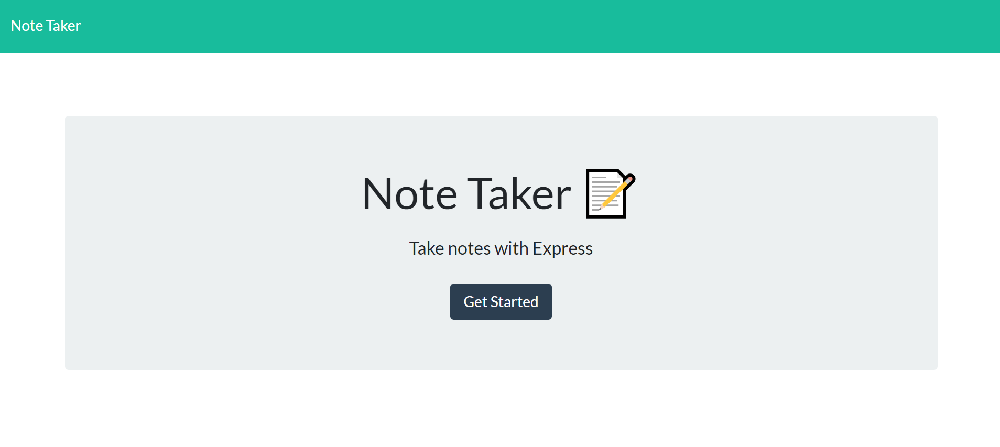
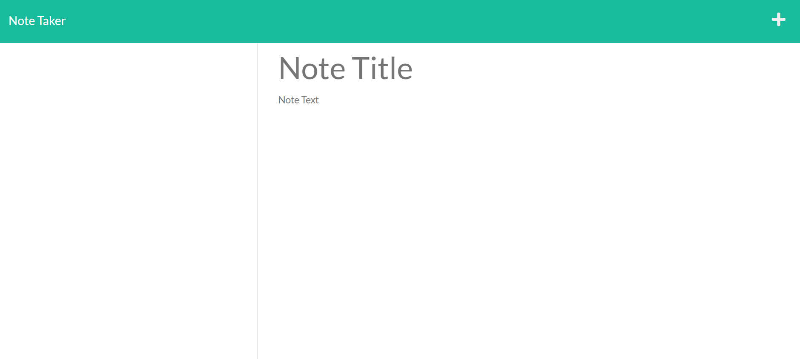

Finished homework assignment for week 11: Note Taker Application

Name: Take Some Notes

The objective of this week's assignment was to modify starting code to create a website application that can be used by users to write and save notes and then allows the user to retrieve note data from a json file.

When loaded, a page will be displayed with existing notes and empty fields to enter a new note.  When the user clicks on the write icon, an empty field will be available to write text for the new note.  After the user enters text, a save icon will appear allowing the user to save the note and will appear in the column with the other existing notes and can be retrieved for the user by clicking on it.

Live URL:

Github URL:

https://github.com/trevorwiegand92/Take-Some-Notes

Screenshots:

